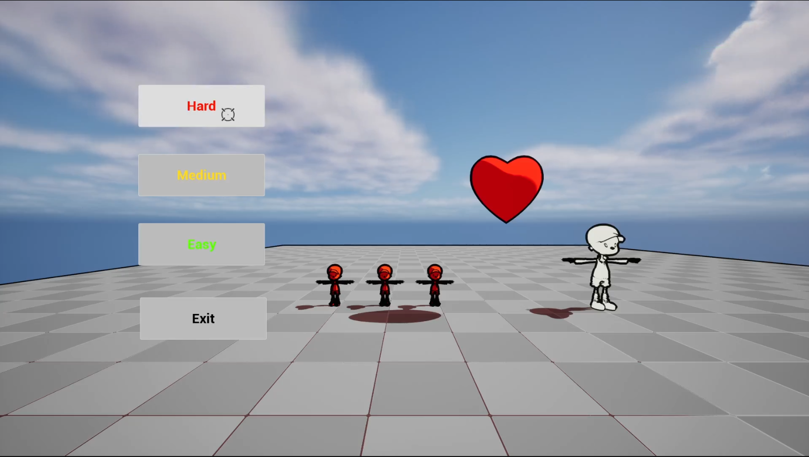
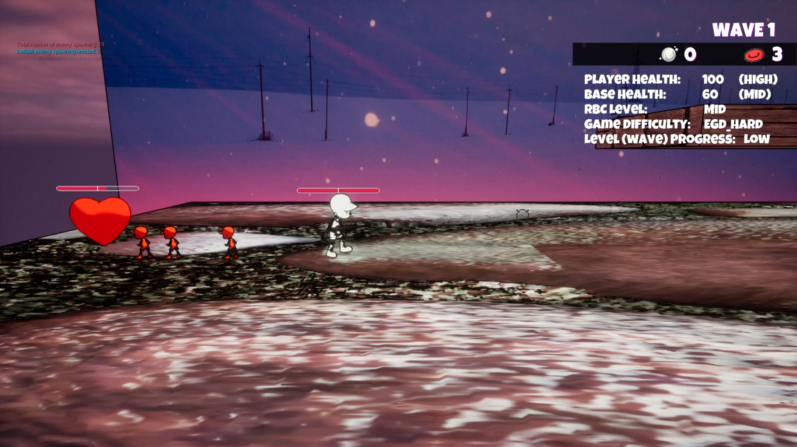
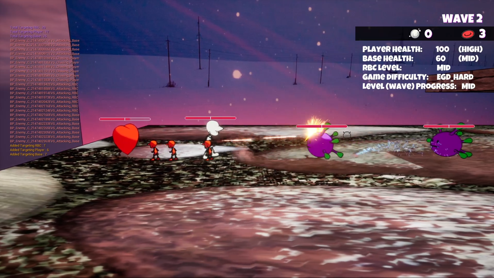
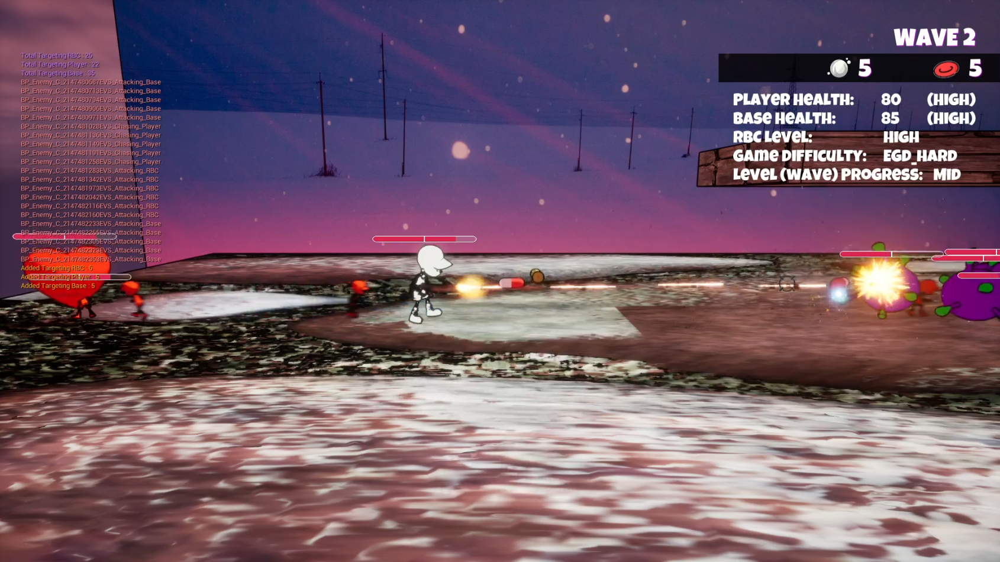
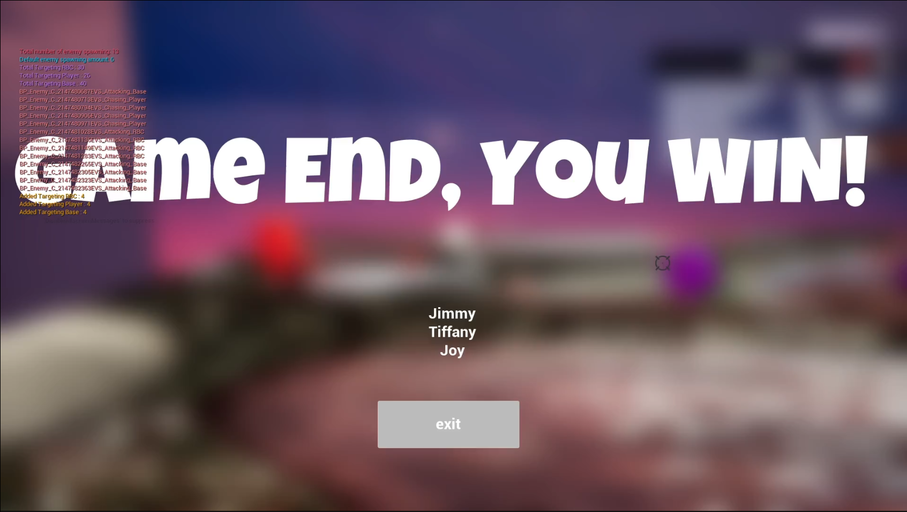

# BodyFrontline

A first-person shooter platform game developed with Unreal Engine 5

# Trailer Video
[A video trailer for the game](https://youtu.be/rXww7bupdYc)

# Game Mechanism
To achieve winning in "Body Frontline," The player's goal is clear: complete a certain number of enemies and complete various waves to fully restore the heart's health. The number of enemies generated in each wave is calculated by the **director AI** implemented in the game, and the number of waves is based on the difficulty level. The game offers various levels of difficulty to accommodate all players, from beginners to seasoned gamers. 

Moreover, director AI is being implemented to adjust the enemy amount based on player performance. Absorbing oxygen will increase the heart's health by a certain amount, and oxygen is only dropped by defeating enemies, so aim to eliminate as many enemies as possible. Meanwhile, the heart's health does not only increase; it can also decrease. Enemies will be organized into formations to confront the player, such as forming different unit teams that attack different targets including hearts. Therefore, if the base's health drops to zero, the player loses, and the game ends. 

At the same time, the player is not fighting alone; red blood cells act as allied AI to help collect oxygen, which has a powerful effect. It not only can increase the base's (heart's) health but can also produce more red blood cells. Additionally, red blood cells can assist player by taking fire from viruses, allowing the player to attack enemies in different ways. 

If all the red blood cells on the field die, the player loses, and the game ends. To increase the game's playability, viruses will drop not only oxygen but also randomly drop pills or bullets to restore the player's health or temporarily increase the player's attack power. In cases of bad luck, nothing but oxygen will drop.

# Controls
- A & D: Move on the platform.
- E: Pick up weapons.
- Space: Jump.
- Mouse Cursor: Aiming.
- Left Mouse Button: Fire.

# AI technique implemented
In the game, two main AI techniques have been implemented: pathfinding using a variant of the A* algorithm and a Director AI that utilizes gameplay metrics to make decisions about enemy spawning and behavior.

## Pathfinding AI
The pathfinding AI is used by both the Red Blood Cells (RBC) and Viruses. RBCs use pathfinding to collect oxygen and return it to the base, while Viruses use pathfinding to navigate towards their assigned targets (player, RBCs, or base) and collect oxygen to level up.

Since the game environment is in 3D but with 2D-only movement, a modified version of the A* pathfinding algorithm has been implemented. These links allow the AI agents to jump up to and down from platforms while moving towards their assigned targets.

## Director AI
The Director AI is responsible for dynamically adjusting the game difficulty based on the player's performance and progress. It uses various gameplay metrics to determine the number of enemies to spawn in each wave and their target assignments.

The gameplay metrics considered by the Director AI include:
- Player's Health
- Oxygen Level
- Current Game Difficulty
- Player's Progress
- RBC Amount
- Time to complete the previous Wave

Based on these metrics, the Director AI calculates the number of enemies to spawn in each wave using a matrix that assigns weights to each factor.

The Director AI also determines the target assignments for the spawned enemies based on the player's health, oxygen level, and RBC amount. It assigns a percentage of enemies to each target (player, base, or RBCs) based on the current level of these metrics. The enemies are reassigned every 10 seconds. 

These AI techniques work together to create a dynamic and challenging gameplay experience. The pathfinding AI allows the RBCs and Viruses to navigate the 3D environment intelligently, while the Director AI adapts the game difficulty and enemy behavior based on the player's performance and progress.

To demonstrate the Director AI's decision-making process, the following information is displayed on the console screen:
- All gameplay metrics
- Actual number of enemies generated each wave vs. default number of enemies
- Number of enemies sent towards each target action for each wave

# In-Game Screenshots

### Start Menu

### Beginning of the Game

### Battle
Wave 1

Wave 2

### Game End
